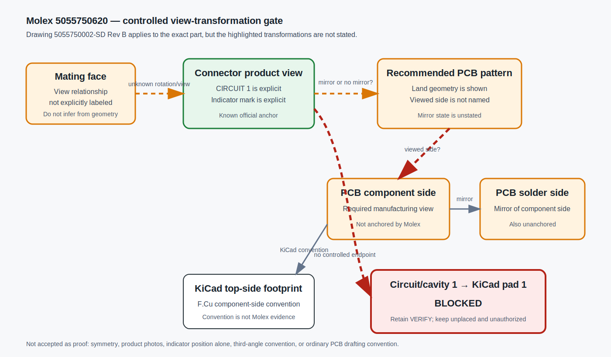

# UNSENT controlled manufacturer clarification request — Molex 5055750620

Status: **CLOSED UNSENT — EXTERNAL CONTACT PROHIBITED — CONNECTOR REPLACED**  
Prepared: 2026-07-20

> [!CAUTION]
> Historical evidence only. This request was never sent and must not be transmitted. Proposal 015M permanently prohibits external contact and replaces Molex 5055750620 with JST ZE for this project.

## Historical intended recipient (inactive)

Molex technical support / product engineering for part `5055750620` and drawing family `5055750002-SD`.

## Subject

5055750620 circuit/cavity-1 to component-side recommended-PCB-layout confirmation

## Historical request (inactive)

We are reviewing Molex Micro-Lock Plus vertical SMT header `5055750620`. The official file delivered at the `5055750291_sd.pdf` URL has the controlled title-block identity `5055750002-SD`, PSD 000, Rev B. Sheet 5 explicitly lists `5055750620`, so exact-part applicability is clear.

The drawing identifies `CIRCUIT 1` in a connector product view and includes a `RECOMMENDED PCB PATTERN LAYOUT`. We cannot find a controlled note that identifies the PCB pattern as viewed from the PCB component side or states whether it is mirrored relative to the circuit-1 product view.

Please provide a controlled written reply or marked drawing that answers all of the following:

1. Is the recommended PCB pattern in `5055750002-SD` Rev B viewed from the PCB component side, solder side, or another named view?
2. In that stated view, which one of the six signal lands is circuit/cavity 1?
3. Is the recommended PCB pattern mirrored or unmirrored relative to the product view containing the `CIRCUIT 1` indicator?
4. When the header is mounted on the PCB top/component side, should the six copper lands be numbered 1→6 from left to right or 6→1 from left to right when viewed from that component side? Please mark the viewing direction.
5. Is an exact `5055750620` official DXF/2D, STEP/3D, ECAD footprint, or ECAD symbol available? If so, please provide the asset identity/revision and the view convention used for pad numbering.

## Labeled ambiguity diagram



Compact form:

```text
5055750002-SD product view                 Recommended PCB pattern
┌─────────────────────────┐                ┌─────────────────────────┐
│ CIRCUIT 1 is explicit   │ -- ? mirror ->│ viewed side is unstated │
└─────────────────────────┘                └────────────┬────────────┘
                                                       │ ? component side
                                                       v
                                            ┌─────────────────────────┐
                                            │ Which land is cavity 1? │
                                            └─────────────────────────┘
```

An acceptable closure is a controlled reply or marked drawing that explicitly connects cavity 1 to one land in the **component-side** recommended PCB layout and states the mirror/no-mirror relationship. A photograph or unmarked symmetric pattern will not close the design-control gate.

## References

- Exact product: <https://www.molex.com/en-us/products/part-detail/5055750620>
- Controlled drawing `5055750002-SD` Rev B: <https://www.molex.com/content/dam/molex/molex-dot-com/products/automated/en-us/salesdrawingpdf/505/505575/5055750291_sd.pdf>
- Application specification `5055700001` Rev F / A03: <https://www.molex.com/content/dam/molex/molex-dot-com/products/automated/en-us/applicationspecificationspdf/505/505570/5055700001-A03.pdf>

No message was sent. External contact is permanently prohibited for this project, and this historical request is closed because the connector was replaced.
