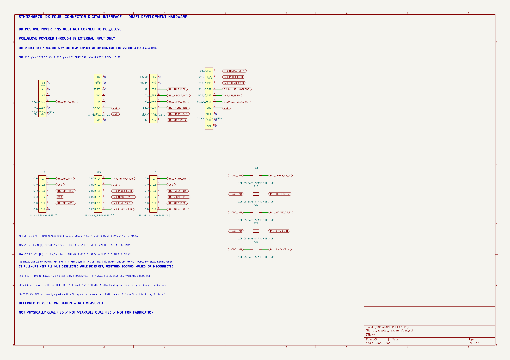
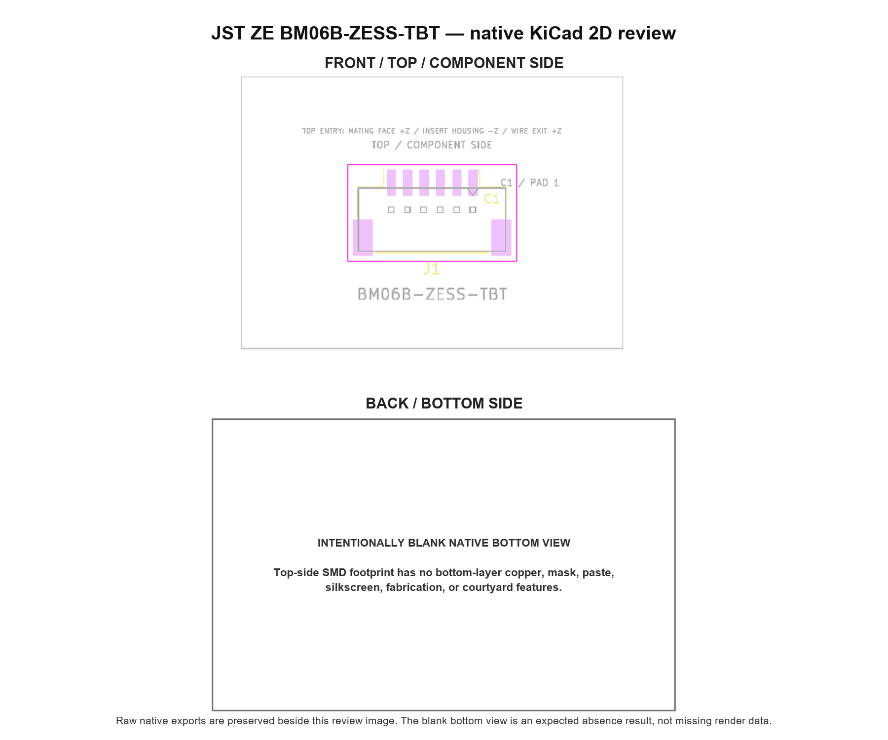

# Proposal 015M — in-house JST ZE harness connector replacement

Date: 2026-07-20  
Authorization: `APPROVE PROPOSAL_015M_IN_HOUSE_JST_ZE_HARNESS_CONNECTOR_REPLACEMENT`  
Result: **JST ZE DIGITAL CONNECTOR REPLACEMENT PASS — PHYSICAL QUALIFICATION OPEN**

> [!CAUTION]
> **NO EXTERNAL CONTACT OR MANUFACTURER QUESTIONS.** This project uses in-house analysis and publicly released documentation only. Molex 5055750620 is rejected for PCB_glove. Main-PCB placement, routing, fabrication and physical qualification remain unauthorized.

## Executive result

The three logical harness connectors in `PCB_glove/dk_adapter_headers.kicad_sch` are now project-local JST ZE `BM06B-ZESS-TBT` interfaces with these controlled fields:

- Header: `BM06B-ZESS-TBT`
- Housing: `ZER-06V-S`
- Contact: `SZE-002T-P0.3`
- Wire: Alpha Wire `422607`, 26 AWG
- Hand tool reference: `YRS-1460`
- Preferred finished harness length: 50 mm
- Provisional maximum length: 100 mm pending physical signal-integrity testing

J14, J15 and J16 keep their exact approved six-position logical allocations. No wire, DK contact, source ground, chip-select pull-up, R1/R2 boundary, or power architecture changed.

The selected JST drawing provides an explicit orientation chain that the retired Molex evidence did not:

`JST circuit 1 -> connector-mounting-surface land 1 -> PCB component-side land 1 -> KiCad top-side pad 1`

The project-local footprint directly reproduces the catalog-view orientation: pad 1 is the rightmost signal land at `(3.75, -2.75)` mm. The raw footprint, deterministic overlay validator and native front view agree.

## Scope and architecture decision

### Rejected system

Molex `5055750620` is rejected because publicly released evidence did not establish an absolute cavity-1 to component-side PCB-land mapping. The existing clarification request is now stamped:

`CLOSED UNSENT — EXTERNAL CONTACT PROHIBITED — CONNECTOR REPLACED`

It remains historical evidence only and was not sent. The old project-local Molex footprint remains unplaced and retains its `VERIFY` markings. Its stale exact-part-DXF provenance claim was corrected and it now contains visible warnings on F.SilkS and F.Fab:

`DEPRECATED — DO NOT PLACE — REPLACED BY JST ZE`

The old geometry was not renumbered or silently released.

### Selected system

JST ZE was selected because the released JST catalog explicitly names the PCB-layout viewing surface and circuit 1, publishes the six-circuit part identity and land geometry, and publishes the compatible terminal range. This is a digital design selection, not a physical qualification.

No part was purchased. No connector was placed on `PCB_glove.kicad_pcb`. No service fixture or camera circuit was created.

## Exact electrical preservation

### J14 — SPI group `[I]`

| Circuit | Preserved net | Source/boundary |
|---:|---|---|
| 1 | `IMU_SPI_SCK` | CN12-6 / PE15 through R1 |
| 2 | `GND` | CN12-7 |
| 3 | `IMU_SPI_MISO` | CN12-5 / PH8 |
| 4 | `GND` | CN8-6 branch A |
| 5 | `IMU_SPI_MOSI` | CN12-4 / PG2 through R2 |
| 6 | DNC | Explicit no-connect; no terminal and no wire |

### J15 — CS_N group `[II]`

| Circuit | Preserved net | Source / safe-state element |
|---:|---|---|
| 1 | `IMU_THUMB_CS_N` | CN12-3 / PA3; R18 pull-up |
| 2 | `GND` | CN8-6 branch B |
| 3 | `IMU_INDEX_CS_N` | CN12-2 / PE14; R19 pull-up |
| 4 | `IMU_MIDDLE_CS_N` | CN12-1 / PE7; R20 pull-up |
| 5 | `IMU_RING_CS_N` | CN11-8 / PD6; R21 pull-up |
| 6 | `IMU_PINKY_CS_N` | CN11-7 / PE13; R22 pull-up |

### J16 — INT1 group `[III]`

| Circuit | Preserved net | Source |
|---:|---|---|
| 1 | `IMU_THUMB_INT1` | CN11-6 / PE10 |
| 2 | `GND` | CN8-7 |
| 3 | `IMU_INDEX_INT1` | CN11-5 / PH5 |
| 4 | `IMU_MIDDLE_INT1` | CN11-4 / PE9 |
| 5 | `IMU_RING_INT1` | CN11-3 / PD0 |
| 6 | `IMU_PINKY_INT1` | CN7-4 / PD11 |

The exported netlist proves exactly 13 approved signals and exactly three physical DK source-ground contacts: CN12-7, CN8-6 and CN8-7. CN8-6 intentionally branches after the DK contact to two harness ground circuits, producing four harness ground cavities from three DK source contacts.

The following invariants also pass:

- R1 remains between `DK_IMU_SPI_SCK_TBD` and `IMU_SPI_SCK`.
- R2 remains between `DK_IMU_SPI_MOSI_TBD` and `IMU_SPI_MOSI`.
- R18–R22 remain five 10 kΩ pull-ups from `+3V3_IMU` to the five CS_N nets.
- CN8 IOREF, 3V3, 5V and VIN remain electrically absent.
- External J9 power architecture is unchanged.
- The four Amphenol DK breakout connectors and boards are unchanged.

## Project-local symbol and footprint

The active project symbol is `PCB_glove_Draft:JST_ZE_BM06B_ZESS_TBT`. It has passive circuits 1–6 and assigns only the project-local footprint:

`PCB_glove:JST_ZE_BM06B-ZESS-TBT_1x06_P1.50mm_Vertical`

The footprint contains:

- six rectangular F.Cu/F.Mask/F.Paste signal lands at 1.50 mm pitch;
- two netless `MP` F.Cu/F.Mask/F.Paste retention lands;
- drawing-backed reference F.Fab body geometry;
- a visible circuit-1 silkscreen mark and F.Fab `C1 / PAD 1` note;
- an explicit `TOP / COMPONENT SIDE` note;
- an explicit `TOP ENTRY: MATING FACE +Z / INSERT HOUSING -Z / WIRE EXIT +Z` note;
- F.SilkS, F.Fab and F.CrtYd graphics;
- a project-selected 0.50 mm courtyard expansion around the copper-land envelope.

### Manufacturer-controlled geometry

- Pitch: 1.50 ±0.05 mm; cumulative pattern error no more than ±0.1 mm.
- Signal land: 0.80 mm minimum × 2.40 mm minimum.
- Retention land: 1.80 ±0.1 mm × 3.30 ±0.1 mm.
- Six-circuit `A`: 7.50 mm.
- Nominal/reference body `B`: 13.50 mm.
- Nominal/reference body depth: 5.80 mm.
- Nominal/reference height: 7.50 mm.

JST identifies the PCB-pattern dimensions as reference values. The body depth/width/height are not converted into maximum envelopes.

### Project-selected implementation rules

- Project origin at the center of the copper-land envelope.
- Rectangular land corners because no manufacturer corner radius is given.
- F.Mask and F.Paste on every land with zero footprint-local adjustment. Effective openings inherit future board/process rules; only the isolated validation board renders 1:1. JST publishes no mask-expansion, paste-reduction, or stencil rule, so those process gates remain open.
- 0.50 mm rectangular courtyard expansion around the land envelope.
- Silkscreen clipping and marker style.

### Still-open physical geometry

No maximum body, mated housing, lock-release, cable bend, snag, strain relief, skin-contact, or wearable-clearance envelope is claimed. Top entry closes only the Z-axis relationship: the mating interface faces `+Z`, insertion travel is toward the PCB (`-Z`), and the mated wire exit is `+Z`. The released layout does not explicitly bind the outer-lock release face to project `+Y` or `-Y`.

## Wire and tooling compatibility

The [JST ZE catalog](https://www.jst-mfg.com/product/pdf/eng/eZE.pdf) gives `SZE-002T-P0.3` a range of AWG 28–24 and 0.76–1.20 mm insulation OD. The [Alpha Wire 422607 specification](https://www.alphawire.com/disteAPI/SpecPDF/DownloadProductSpecPdf?productPartNumber=422607) gives 26 AWG and 0.039 ±0.002 inch OD, equal to 0.9398–1.0414 mm. The entire published Alpha OD tolerance lies inside the JST range.

The JST tooling table maps `YRS-1460` to `SZE-002T-P0.3` and includes UL1061 26 AWG.

Result: **digital wire/tool applicability pass only**. Crimp height, pull force, conductor-brush position, sectioning, terminal retention, repeated mating and flex life remain physical gates.

## Identical-connector cross-plug risk

All six directed wrong-port cases were analyzed. Three are critical:

- SPI harness → CS port can ground a driven MCU output and can contend an MCU output with shared MISO.
- INT harness → SPI port can create output/output conflicts and ground a push-pull INT output.
- INT harness → CS port can create up to five output/output conflicts.

The other three cases can force false interrupt/selection states, remove CS bias, float inputs, or enable multiple IMU MISO drivers. No wrong-port insertion is acceptable while energized.

No publicly documented mutually incompatible six-position ZE key variants were located. Required future board and harness labels are documented, but labels/colors do not prevent mis-mating. A conceptual in-house three-port comb/shroud is documented without dimensions and receives no physical-safety credit.

See `proposal_015m_wrong_port_insertion_analysis.md` and `proposal_015m_three_group_cavity_wire_color_map.csv`.

## Validation result

| Check | Result | Controlling artifact |
|---|---|---|
| Full hierarchical native KiCad ERC | **0 errors / 0 warnings** | `../reports/proposal_015m/proposal_015m_hierarchical_erc.rpt` |
| Exported-netlist connector map | **PASS — exact 13 signals** | `../reports/proposal_015m/proposal_015m_mapping_validation.json` |
| DK source-ground contacts | **PASS — exactly 3** | Same mapping validation |
| Harness ground cavities | **PASS — exactly 4 from 3 DK contacts** | Same mapping validation |
| Five CS pull-ups | **PASS — R18–R22 preserved** | Same mapping validation |
| CN8 positive-power isolation | **PASS — IOREF/3V3/5V/VIN absent** | Same mapping validation |
| Project footprint overlay validator | **PASS** | `../reports/proposal_015m/proposal_015m_footprint_overlay_validation.log` |
| Footprint-only native KiCad DRC | **0 violations / 0 unconnected pads / 0 footprint errors** | `../reports/proposal_015m/proposal_015m_jst_ze_footprint_drc.rpt` |
| Closed breakout mapping validator | **PASS** | `../reports/proposal_015m/proposal_015m_closed_breakout_validation.log` |
| Raw symbol/footprint review | **PASS** | This report and exact overlay CSV |
| Native front/back review | **PASS with disclosed blank bottom view** | `../reports/proposal_015m/proposal_015m_jst_ze_front_back_review.png` |
| kicad-happy schematic analyzer | **0 errors; 10 warnings; 24 info** | `../reports/proposal_015m/proposal_015m_schematic_analyzer.json` |
| Protected-file hashes | **PASS / qualified only for pre-existing untracked kicad-happy trees** | `../reports/proposal_015m/proposal_015m_protected_file_hash_verification.md` |

The kicad-happy analyzer is an advisory topology/consistency audit, not ERC and not manufacturer evidence. Its ten warnings are draft-level findings such as connector return-path ratios, missing ESD coverage, incomplete MPN/footprint coverage and absent local datasheet-directory recognition. They do not invalidate the connector mapping, but they remain design-review gates. The official JST/Alpha evidence matrix, not the analyzer, controls the part-specific claims.

## Native review images

The bottom view is intentionally blank because the selected footprint is top-side SMD and contains no B.Cu, B.Mask, B.Paste, B.SilkS or B.Fab feature. The blank bottom view is evidence of absence, not missing render data.

Any installed KiCad STEP model or 3D render is a **non-controlling convenience view only**. It is not official JST envelope evidence and closes no body, latch, mating, cable-bend, strain-relief, skin-contact, or wearable-clearance gate.

## Protected and forbidden scope verification

- `PCB_glove/PCB_glove.kicad_pcb` is byte-for-byte unchanged.
- All four closed DK breakout schematics and PCBs are byte-for-byte unchanged.
- `reference_designs/imu_pcb/` is tree-digest unchanged.
- `kicad-happy` tracked HEAD and its two pre-existing top-level untracked names are unchanged; no write targeted it.
- The root schematic, project file, and project library tables are unchanged.
- No global KiCad library was edited.
- No camera circuit or service fixture was created.
- No Gerber, drill, stencil, pick-and-place, purchasing, or fabrication-release output was created.
- No external person or company was contacted.
- No new inquiry draft was created.

## Report-generation scope and intentionally omitted analyses

The report package includes schematic/topology validation, source traceability, footprint overlay, raw/native visual review, cross-plug analysis, protected hashes and physical-gate registration.

The following are intentionally not run because Proposal 015M forbids main-PCB design/fabrication and provides no physical hardware:

- main-PCB DRC, placement, routing, return-path or stack-up review;
- PCB thermal/EMC/crosstalk simulation;
- regulator derating, SPICE or power-tree changes;
- Gerber/drill/stencil/pick-and-place/manufacturing-output review;
- physical connector fit, crimp, insertion, pull, bend, strain, skin, flex or wearable testing;
- network lifecycle/purchasing audit.

These omissions are scope controls, not passes.

## Artifact index

- Main report: this file.
- Official evidence: `proposal_015m_jst_official_source_evidence_matrix.csv`.
- Exact footprint overlay: `proposal_015m_jst_ze_footprint_overlay.csv`.
- Old-to-new system mapping: `proposal_015m_molex_to_jst_connector_mapping.csv`.
- Cavity/color map: `proposal_015m_three_group_cavity_wire_color_map.csv`.
- Wrong-port analysis: `proposal_015m_wrong_port_insertion_analysis.md`.
- Mechanical/open gate register: `proposal_015m_jst_mechanical_open_physical_gate_register.csv`.
- Validation and native renders: `../reports/proposal_015m/`.
- Exact changed-file manifest: `proposal_015m_changed_file_manifest.csv`.
- Protected verification: `../reports/proposal_015m/proposal_015m_protected_file_hash_verification.md`.
- Current handoff: `../HANDOFF_CURRENT.md`.

## Gate decision

`JST ZE DIGITAL CONNECTOR REPLACEMENT PASS — PHYSICAL QUALIFICATION OPEN`

Main-PCB placement, routing and fabrication remain unauthorized. A future placement proposal must not proceed until the high-priority cross-port keying/human-factors gate and the required maximum-envelope, latch-access, crimp, cable, strain-relief, signal-integrity, backfeed and wearable gates are closed by controlled in-house evidence.
