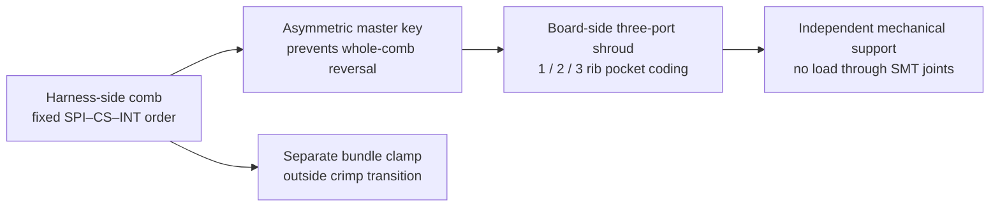

# Proposal 015M — JST ZE wrong-port insertion analysis

Date: 2026-07-20  
Status: **DIGITAL ANALYSIS COMPLETE — PHYSICAL/HUMAN-FACTORS GATE OPEN**

## Controlled conclusion

J14, J15 and J16 use the same six-position JST ZE mating interface. The public JST ZE documents show ordinary polarization and a secure outer lock, but no publicly documented mutually incompatible six-position key variants were located for the selected `BM06B-ZESS-TBT` / `ZER-06V-S` system. Housing colors and labels do not mechanically prevent cross-mating.

Every wrong-port insertion is unsafe. Three of the six directed cases can create direct output contention or an output-to-ground condition. No wrong-port insertion is acceptable while energized.

## Exact identification scheme

Future main-board silkscreen requirements, not implemented because the main PCB is protected:

- `J14 · SPI ONLY · [I] · C1>`
- `J15 · CS_N ONLY · [II] · C1>`
- `J16 · INT1 ONLY · [III] · C1>`
- `IDENTICAL JST ZE 6P — VERIFY GROUP — NO HOT-PLUG`

Harness flags, printed on both sides immediately behind the housing:

- `H-J14 · SPI · [I] · J14 ONLY`
- `H-J15 · CS_N · [II] · J15 ONLY`
- `H-J16 · INT1 · [III] · J16 ONLY`

Every remote termination also carries group, circuit and function, for example `SPI-C1-SCK`, `CS-C4-MIDDLE`, and `INT-C6-PINKY`.

These markings are inspection aids only. They must not be credited as physical keying.

## Wire-color rule

- All ground conductors: **BLACK**.
- Non-ground circuit 1: **BROWN**.
- Non-ground circuit 3: **RED**.
- Non-ground circuit 4: **ORANGE**.
- Non-ground circuit 5: **YELLOW**.
- Non-ground circuit 6: **VIOLET**.
- J14 circuit 4 is black because the ground rule overrides its ordinary circuit color.
- J14 circuit 6 has **NO TERMINAL / NO WIRE**.

The exact 18-circuit table is in `proposal_015m_three_group_cavity_wire_color_map.csv`. Color identifies circuit/ground, not connector group; the CS and INT harnesses remain visually indistinguishable by color pattern alone.

## Every directed wrong-port insertion

| Wrong insertion | Exact circuit consequences | Contention and pull-up effects | Classification |
|---|---|---|---|
| SPI harness → J15 CS | C1 thumb-CS output drives all SCK inputs; C3 index-CS output meets shared MISO outputs; C4 middle-CS output is grounded; C5 ring-CS output drives all MOSI inputs; C6 pinky-CS ends open | Conditional output/output contention at C3 whenever an IMU MISO drives. C4 is an MCU-output-to-ground fault when driven high. R18/R19/R21 pull SCK/MISO/MOSI high; R20 supplies about 0.33 mA into ground while the MCU is high-impedance. | **CRITICAL** |
| SPI harness → J16 INT | C1 and C5 join DK inputs to IMU bus inputs; C3 feeds shared MISO into index INT; C4 grounds middle INT input; C6 is open | MISO activity can appear as false interrupts, middle interrupt is forced low, and the SPI bus is disconnected. No inherent direct output conflict is proven for this direction alone. | **UNSAFE — no immediate overcurrent proven** |
| CS harness → J14 SPI | SCK toggles thumb CS; MISO input meets index CS input; GND forces middle CS low; MOSI toggles ring CS; pinky CS is open | Middle IMU is continuously selected. Thumb/ring selection follows bus activity. Index and pinky CS inputs lose J15 pull-ups and may float; multiple MISO drivers can become enabled. | **UNSAFE** |
| CS harness → J16 INT | Five DK interrupt inputs connect to five IMU CS inputs; C2 ground aligns | Input-to-input connections provide no valid CS bias. All five CS inputs lose J15 pull-ups and may float, permitting unintended or multiple selection. | **UNSAFE — no immediate overcurrent proven** |
| INT harness → J14 SPI | SCK output meets thumb INT output; MISO input receives index INT; GND shorts middle INT output when high; MOSI output meets ring INT output; pinky INT is open | Direct output/output contention is possible at C1 and C5. C4 shorts a push-pull INT output to ground when asserted. R1/R2 are provisional signal-integrity boundaries and are not protection devices. | **CRITICAL** |
| INT harness → J15 CS | Each DK CS output connects to the corresponding push-pull IMU INT output; C2 ground aligns | Five possible output/output conflicts. R18–R22 also pull every INT output high and violate the approved no-pull INT startup contract. A low INT sees about 0.33 mA through its pull-up while the MCU is high-impedance, but an oppositely driven MCU output is not limited by 10 kΩ. | **CRITICAL** |

Physical two-cable transpositions therefore classify as:

- SPI ↔ CS: **CRITICAL**.
- SPI ↔ INT: **CRITICAL**.
- CS ↔ INT: **CRITICAL**.

Circuit 2 ground aligns in all three systems. J14's extra circuit-4 ground is the key asymmetry: every SPI/CS or SPI/INT cross-mating connects that ground to a signal. No selected harness connector carries a positive supply rail, but J15 couples `+3V3_IMU` through five 10 kΩ pull-ups and asymmetric-power I/O backfeed remains unqualified.

## Published key-variant result

The controlled wording is:

> No publicly documented mutually incompatible six-position key variants were located for the selected JST ZE system.

The [JST ZE catalog](https://www.jst-mfg.com/product/pdf/eng/eZE.pdf) and [ZE product page](https://www.jst-mfg.com/product/index.php?lang=2&series=470) document ordinary polarized mating, secure locking, colors, and certain through-hole board-boss options. They do not publish separate six-position mating-key codes for the selected SMD header/housing. A board polarizing boss does not discriminate identical cable housings, and a housing color is not a mechanical key.

For comparison only, JST explicitly advertises three key patterns when its [BNI family](https://www.jst-mfg.com/product/index.php?series=703&lang=2) provides that feature. This supports the conservative reading; it does not prove the nonexistence of every unpublished ZE variant.

## Conceptual in-house carrier/shroud

Concept only:

- A harness-side comb captures all three `ZER-06V-S` housings in fixed SPI–CS–INT order.
- A board-side shroud surrounds all three headers and transfers insertion loads into a separate support.
- An asymmetric master key prevents reversing the entire comb.
- One-, two-, and three-rib pocket shapes discriminate SPI, CS and INT.
- The JST release latches remain accessible.
- A separate bundle clamp provides strain relief outside the crimp transition.

No dimension, tolerance, material, attachment, load capacity, latch clearance, cable bend, snag, skin-contact, retention or cycle-life value is established. The concept cannot be credited as keying until separately dimensioned, built and physically tested.

## Gate result

`WRONG-PORT INSERTION GATE: OPEN — HIGH PRIORITY`

Main-PCB placement, routing, fabrication, hot-plug use and physical safety claims remain unauthorized.
