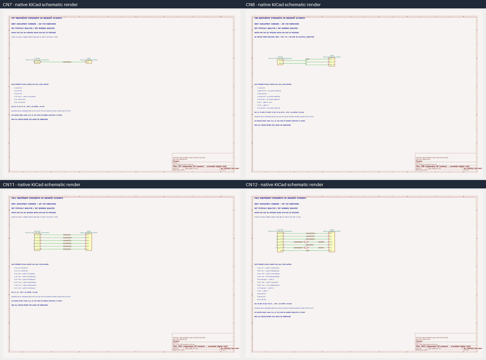

# Proposal 015K - Breakout Schematic Parity and Footprint Closure

> [!success] Digital breakout closure passed
> CN7, CN8, CN11, and CN12 have fully annotated standalone schematics. Every breakout passes native ERC, genuine schematic parity, native DRC, deterministic validation, and independent raw/rendered review.

> [!danger] Main PCB and fabrication remain blocked
> Molex `5055750620` cavity-1 handedness is not proven by controlled component-side and mirror-state evidence. The footprint remains `VERIFY`, unplaced, and unauthorized. No main-PCB placement, routing, physical qualification, or fabrication work is authorized.

## Gate snapshot

| Check | CN7 | CN8 | CN11 | CN12 |
|---|---:|---:|---:|---:|
| ERC errors / warnings | 0 / 0 | 0 / 0 | 0 / 0 | 0 / 0 |
| Native schematic-parity issues | 0 | 0 | 0 | 0 |
| DRC violations / unconnected / footprint errors | 0 / 0 / 0 | 0 / 0 / 0 | 0 / 0 / 0 | 0 / 0 / 0 |
| Independent review | PASS | PASS | PASS | PASS |

## Preserved electrical invariants

- Exactly three DK source-ground contacts: `CN8-P6`, `CN8-P7`, and `CN12-P7`.
- CN8 `IOREF`, `3V3`, `5V`, and `VIN` remain netless, unrouted NPTH contacts.
- Every DNC contact remains unnumbered, netless NPTH with no copper route.
- CN12 MOSI boundary: `P4 DK_IMU_SPI_MOSI_TBD -> R2 -> IMU_SPI_MOSI -> J_WIRE1 P4`.
- CN12 SCK boundary: `P6 DK_IMU_SPI_SCK_TBD -> R1 -> IMU_SPI_SCK -> J_WIRE1 P6`.
- No power, signal, pull-up, test-point, or harness connection was invented.

## Footprint status

> [!info] Amphenol overlay closure
> The 77311 F.Fab outlines now match the released nominal body dimensions. The 0.50 mm courtyard expansion and 1.70 mm copper land remain documented project choices, not manufacturer tolerances.

> [!warning] Molex evidence gap
> Official sources identify circuit 1 and show a recommended PCB layout, but do not explicitly connect that layout to component-side viewing or a mirrored/unmirrored relationship. Symmetry, photographs, indicators, and drafting convention are not accepted substitutes.

## Protected scope

- Main PCB SHA-256 remains `3E491CD8085EFF0D6C95F0A11A135421CBCFCE4C5620E6356C3896E122F1772B`.
- Reference IMU tree digest remains `8C1366CEA6AEFD840CA30CDF9836D7975E15D4F434CA3F201D81A4071151A07B`.
- `kicad-happy` remains at `839d9b03c42358ab16f2eedfdea6c4bc6469826f`.
- No global KiCad library, service fixture, camera circuit, or fabrication-release output changed.

## Evidence

- [Completion and gate report](../.kicad_agent/proposals/proposal_015k_breakout_schematic_parity_and_footprint_closure.md)
- [Exact changed-file manifest](../.kicad_agent/proposals/proposal_015k_changed_files.md)
- [Native validation summary](../.kicad_agent/reports/proposal_015k_breakout_closure/native_validation_summary.json)
- [Independent raw and rendered review](../.kicad_agent/reports/proposal_015k_breakout_closure/independent_raw_and_rendered_review.md)
- [Protected-file verification](../.kicad_agent/reports/proposal_015k_breakout_closure/protected_file_hash_verification.md)
- [Unsent Molex clarification request](../.kicad_agent/proposals/proposal_015k_molex_5055750620_handedness_clarification_request.md)

## Open actions

- [ ] Obtain controlled Molex evidence that explicitly links cavity 1, the recommended PCB layout, component-side viewing, and mirror state.
- [ ] Complete physical fit, wearable, strain-relief, and thermal qualification.
- [ ] Request a separate main-PCB proposal only after the remaining gates close.

> [!warning] Authorization boundary
> This note records a digital breakout closure only. It is not authorization for PCB placement, routing, physical qualification, purchasing, or fabrication.
